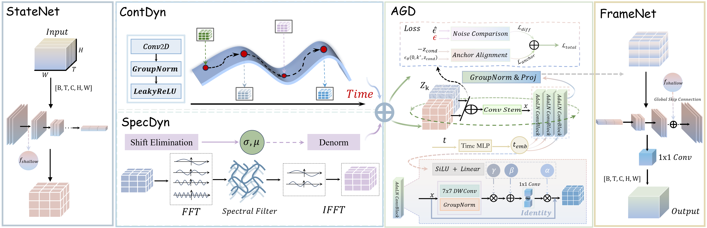

# 🌌 ST-DiODE

### Continuous Physical Dynamics with Anchor-Guided Diffusion for Spatiotemporal Forecasting

`6 benchmarks · 4 metrics · dual-domain dynamics · 1,000 diffusion steps · 14 Python modules`

[Overview](#-overview) • [Method](#-method) • [Results](#-paper-results) • [Structure](#-repository-structure) • [Getting Started](#-getting-started) • [Training](#️-training) • [Reproduction](#-reproduction-checklist)

</div>

---

[](figures/framework.png)

This repository contains the PyTorch implementation of **ST-DiODE** — a spatiotemporal forecasting framework that combines **continuous latent physics**, **global spectral evolution**, and **anchor-guided diffusion** in a single encoder–translator–decoder pipeline.


---

## 🌟 Overview

Spatiotemporal prediction is difficult because future frames are shaped by two different kinds of dynamics:

| Dynamic regime | What must be captured | ST-DiODE component |
| --- | --- | --- |
| 🌀 **Continuous local evolution** | smooth physical transitions and spatial derivatives | **ContDyn** — Neural ODE + RK4 |
| 🌊 **Global temporal structure** | long-range periodicity and frequency-domain correlations | **SpecDyn** — temporal FFT + learnable spectral transform |
| ✨ **Future uncertainty** | multiple plausible futures beyond deterministic regression | **AGD** — anchor-guided conditional diffusion |

ST-DiODE first maps observed frames into a compact latent state, evolves that state through continuous and spectral branches, fuses both forecasts, and then uses the fused trajectory as a condition for latent diffusion.


### Architecture at a glance

| Stage | Input → output | Public implementation | Role |
| --- | --- | --- | --- |
| **StateNet** | frames → latent states | `StateNet` | spatial compression + shallow memory |
| **ContDyn** | initial state → continuous trajectory | `ContDynFunc` + `RK4Solver` | local physical evolution |
| **SpecDyn** | latent history → spectral forecast | `SpecDyn` + `RevIN_Spatial` | global periodic dynamics |
| **Fusion** | two trajectories → condition | `DualStreamTranslator` | cross-domain aggregation |
| **AGD** | condition → refined latent future | `AGD` + `ConditionalDenoisingNet` | uncertainty-aware refinement |
| **FrameNet** | refined latent → output frames | `FrameNet` | spatial reconstruction |

The end-to-end data flow is:

```text
observations [B, T_in, C, H, W]
        │
        ▼
StateNet ─────────────── shallow spatial memory ──────────────┐
        │                                                     │
        ▼                                                     │
latent history                                                │
        ├── ContDyn: Neural ODE + fixed RK4 ──┐               │
        └── SpecDyn: RevIN + FFT + IFFT ──────┤               │
                                               ▼               │
                                      cross-domain fusion       │
                                               │               │
                                               ▼               │
                                  Anchor-Guided Diffusion       │
                                               │               │
                                               ▼               ▼
                                           FrameNet + skip connection
                                               │
                                               ▼
                              predictions [B, T_out, C, H, W]
```

---

## 🧠 Method

### 1. 🧩 StateNet — spatial state encoding

For an observed sequence

$$
\mathbf{X}=\{\mathbf{x}_1,\ldots,\mathbf{x}_{T_{\mathrm{in}}}\},
$$

`StateNet` encodes each frame into a lower-resolution latent state. The public implementation uses `ConvSC` blocks with the alternating stride pattern produced by `stride_generator`.

The encoder returns two representations:

1. a deep latent sequence for temporal evolution;
2. a shallow feature map reused by `FrameNet` as a spatial skip connection.

Code: [`ST_DiODE.py`](https://github.com/Ray-zyy/ST-DiODE/blob/main/ST_DiODE.py) → `BasicConv2d`, `ConvSC`, `StateNet`.

### 2. 🌀 ContDyn — continuous physical dynamics

The continuous branch models latent evolution with

$$
\frac{d\mathbf{z}(t)}{dt}=f_{\theta}(\mathbf{z}(t),t).
$$

`ContDynFunc` parameterizes the derivative through multi-scale inception-style convolutions. `RK4Solver` advances the latent state using fourth-order Runge–Kutta integration:

$$
\mathbf{z}_{n+1}=\mathbf{z}_n+\frac{\Delta t}{6}
\left(k_1+2k_2+2k_3+k_4\right).
$$

The current code uses **two RK4 substeps per predicted interval**.

Code: `ContDynFunc`, `Inception`, `GroupConv2d`, and `RK4Solver` in `ST_DiODE.py`.

### 3. 🌊 SpecDyn — global spectral dynamics

SpecDyn models temporal dependencies in the frequency domain:

$$
\mathbf{Z}_{f}=\mathcal{F}_{t}(\mathbf{Z}),
\qquad
\widehat{\mathbf{Z}}=
\mathcal{F}_{t}^{-1}\!\left(g_{\phi}(\mathbf{Z}_{f})\right).
$$

The code performs four steps:

1. normalize the latent sequence with `RevIN_Spatial`;
2. project $T_{\mathrm{in}}$ into $T_{\mathrm{out}}$;
3. concatenate real and imaginary FFT coefficients and transform them with an MLP;
4. apply inverse FFT and reversible denormalization.

Code: `RevIN_Spatial`, `SpecDyn`, and the spectral branch of `DualStreamTranslator`.

### 4. 🔀 Dual-stream evolution and fusion

`DualStreamTranslator` evolves the same latent history through ContDyn and SpecDyn. Their outputs are concatenated along the channel dimension and fused with convolution, group normalization, and LeakyReLU:

$$
\mathbf{z}_{\mathrm{cond}}
=\mathcal{G}_{\psi}
\left([\mathbf{z}_{\mathrm{cont}};\mathbf{z}_{\mathrm{spec}}]\right).
$$

The result $\mathbf{z}_{\mathrm{cond}}$ is the deterministic condition supplied to AGD.

### 5. ✨ Anchor-Guided Diffusion

For a clean latent target $\mathbf{z}_0$, the forward diffusion process is

$$
\mathbf{z}_t=
\sqrt{\bar{\alpha}_t}\,\mathbf{z}_0+
\sqrt{1-\bar{\alpha}_t}\,\boldsymbol{\epsilon},
\qquad
\boldsymbol{\epsilon}\sim\mathcal{N}(0,\mathbf{I}).
$$

AGD selects the critical anchor timestep

$$
k^*=\arg\min_k\left|\bar{\alpha}_k-0.5\right|,
$$

where signal and noise have approximately equal strength. The conditional denoiser uses sinusoidal timestep embeddings and AdaLN-style ConvNeXt blocks.

The public code defines

$$
\mathcal{L}_{\mathrm{AGD}}
=\lambda\mathcal{L}_{\mathrm{diff}}
+(1-\lambda)\mathcal{L}_{\mathrm{anchor}},
$$

while the training engine optimizes

$$
\mathcal{L}_{\mathrm{total}}
=\mathcal{L}_{\mathrm{recon}}+0.1\mathcal{L}_{\mathrm{AGD}}.
$$

Code: `SinusoidalPositionEmbeddings`, `AdaLN_ConvBlock`, `ConditionalDenoisingNet`, and `AGD`.

### 6. 🎞️ FrameNet — spatial decoding

`FrameNet` upsamples the refined latent states with transposed `ConvSC` blocks, injects the shallow encoder memory, and maps features back to the original channel count.

| Mode | `ST_DiODE.forward(...)` behavior |
| --- | --- |
| **Training** | returns deterministic frames and `agd_loss` |
| **Validation / test** | runs DDIM sampling and returns decoded stochastic predictions |


---

## 📁 Repository Structure

The following tree is derived from the files currently present in [`Ray-zyy/ST-DiODE`](https://github.com/Ray-zyy/ST-DiODE). It intentionally excludes paper-inferred folders that do not exist in the public repository.

```text
ST-DiODE/
├── Main.py                         # ▶ intended entry: data → model → engine → test
├── ST_DiODE.py                     # ★ full architecture + AGD + DDIM sampling
├── engine.py                       # training, validation, checkpointed evaluation
├── metrics.py                      # MSE · MAE · SSIM · PSNR
├── recorder.py                     # best-validation checkpoint recorder
├── utils.py                        # seeds, logging, paths, checkpoint utilities
├── README.md                       # upstream minimal project description
│
├── dataloader/
│   ├── data_preparation.py         # intended unified dataset dispatcher
│   ├── dataloader.py               # generic loader / sampler / prefetch helpers
│   ├── dataloader_file.py          # custom .npy sequences [N,T,C,H,W]
│   ├── dataloader_kth.py           # KTH: 10 input → 20 output frames
│   ├── dataloader_moving_mnist.py  # generated train set + fixed test set
│   ├── dataloader_navier.py        # Navier–Stokes .mat loader
│   ├── dataloader_sevir.py         # SEVIR .npy loader
│   └── dataloader_taxiBJ.py        # TaxiBJ .npz loader
│
└── figures/
    └── framework.png               # framework figure rendered above
```


---

## 🚀 Getting Started

### 1. 🔧 Clone and create the environment

```bash
git clone https://github.com/Ray-zyy/ST-DiODE.git
cd ST-DiODE

conda create -n stdiode python=3.10 -y
conda activate stdiode
```


```bash
# Install torch / torchvision for your CUDA version first, then:
pip install numpy scipy scikit-image timm pillow matplotlib
```

### 2. 📦 Prepare the data

#### Generic `.npy` sequence format

`dataloader/dataloader_file.py` expects:

```text
[N, T, C, H, W]
```

| Axis | Meaning |
| --- | --- |
| `N` | number of sequences |
| `T` | total temporal length |
| `C` | channels |
| `H`, `W` | spatial resolution |

The loader computes **per-channel statistics from the training split only**, normalizes validation and test data with those statistics, and divides every sequence at `input_length`.

#### Dataset-specific sources

| Intended key | Loader | Expected source |
| --- | --- | --- |
| `mmnist` | `load_moving_mnist` | MNIST gzip files + `moving_mnist/mnist_test_seq.npy` |
| `kth` | `load_kth` | KTH action / person frame directories |
| `sevir` | `load_sevir` | root containing `sevir_dataset.npy` |
| `taxibj` | `load_taxibj` | root containing `taxibj/dataset.npz` |
| `navier` | `load_navier` | MATLAB `.mat` file with key `u` |


### 3. 🧪 Run a model-only smoke test

```python
import torch
from ST_DiODE import ST_DiODE

device = "cuda" if torch.cuda.is_available() else "cpu"
model = ST_DiODE(
    shape_in=(10, 1, 64, 64),
    T_out=10,
    hid_S=16,
    N_S=4,
).to(device).eval()

x = torch.randn(2, 10, 1, 64, 64, device=device)
with torch.no_grad():
    y = model(x)

print(y.shape)  # [2, 10, 1, 64, 64]
```

### 4. 🧭 Restore the training entry

`Main.py` is intended to run with:

```bash
python Main.py
```

### 5. 🧾 Required configuration surface


| Group | Required attributes |
| --- | --- |
| Runtime | `use_gpu`, `device`, `gpu`, `seed`, `debug` |
| Paths | `work_dir`, `checkpoint`, `data_root` |
| Experiment | `model`, `dataname`, `epochs`, `log_step`, `is_save_data` |
| Data | `batch_size`, `val_batch_size`, `num_workers`, `in_shape` |
| Model | `hid_S`, `hid_T`, `N_S`, `N_T` |
| Optimization | `lr`, `weight_decay` |


---

## 🧪 Evaluation

`Engine.test()` requires a saved checkpoint, switches the model to evaluation mode, performs DDIM sampling, and reports:

| Metric | Implementation detail |
| --- | --- |
| MSE | global mean squared error after denormalization |
| MAE | global mean absolute error after denormalization |
| SSIM | per-frame average; grayscale and multi-channel paths handled separately |
| PSNR | per-frame average using the evaluation data range |

`metrics.py` clips denormalized values to `[0, 1]` before SSIM and PSNR unless `clip_range=None` is supplied.

When `is_save_data` is enabled, testing writes:

```text
<work_dir>/<model>/<dataset>/<timestamp>/
├── inputs.npy
├── trues.npy
└── preds.npy
```

The best checkpoint defaults to:

```text
<log_dir>/<dataset>_<model>_best.pth
```

---
